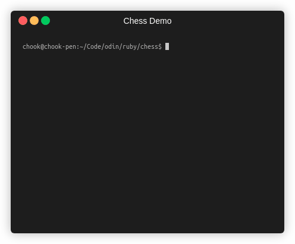

# Chess

A fully functional chess game that can be played in a terminal.

Final assignment for the Ruby section of [The Odin Project](https://www.theodinproject.com/).

Spec and details for the assignment can be found [here](https://www.theodinproject.com/courses/ruby-programming/lessons/ruby-final-project).

Play online on [replit](https://repl.it/@HappyFrog/chess#README.md)

## Demo

## Features

* Various modes - play vs a friend, vs the computer or watch the computer battle itself
* Save and load your game
* Sophisticated artificial intelligence*
* Gorgeous unicode graphics
* Beautiful blue and gray chessboard

\* <em>May not actually be sophisticated or intelligent</em>

## How to use

To play online, go [here](https://repl.it/@HappyFrog/chess#README.md).

To play locally, you must have Ruby installed. See [here](https://www.ruby-lang.org/en/downloads/) for more details. This program was written in Ruby 2.7 but is backwards compatible to at least Ruby 2.5.

If you have Ruby installed, clone this repository, navigate to the top level folder and type ruby main.rb in your terminal, then follow the in game instructions.

To run the tests you must have rspec installed. More info on rspec can be found [here](http://rspec.info/). These tests were written using rspec 3.9. Execute the tests by simply typing rspec in your console in the top level folder.

## Style Guide

Written with the community [ruby style guide](https://rubystyle.guide/). See the .rubocop.yml file for specific tweaks.

## Possible future additions

A more complete list can be found at the project board [here](https://github.com/users/ChargrilledChook/projects/2).

### UI / UX
* Improve UX feedback - why a move failed (invalid move, you are in check etc)
* Improve saving system (more files, custom naming)
* Improve clarity of board / pieces

### Internal
* Various refactorings - particularly en passant, castling, and reducing size of ref and round classes
* Increase test coverage
* More unit tests
* Integration testing?

### Additional Features
* A Puzzle mode - mate in 3 etc
* Smarter AI

## Known Bugs

* It is possible to put yourself in check while doing an en pasasnt move, leading to an illegal board state. This will raise an exception.

## Reflections

The hardest and most complex project I've worked on to date. Difficult both for the depth and breadth of problems to solve, and then integrating those various solutions together in a clean and modular way. Managing the bloat and cruft from various little experiments, or implementations that needed to change after realising they would need to change because of an edge case was a challenge. While I put quite a lot of thought into planning my overall design, which was a useful exercise, there were a lot of things that only became obvious after encountering / working through them.

I definitely see the value of keeping systems as modular as possible, as the parts that were entangled became very difficult to make even small changes on as the project grew in size. Likewise testing discipline is important for being able to make changes and refactor safely.

On the whole a great project and a lot of lessons learned.

## Contact

ChargrilledChook#7159 on discord :chicken:
